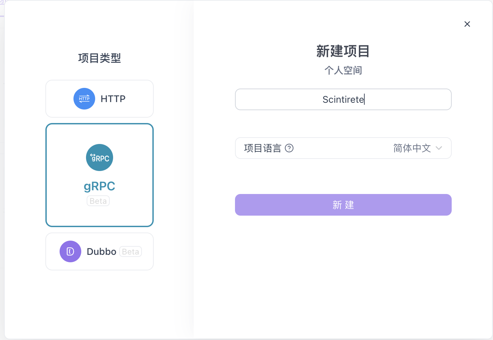

# gRPC Interface Usage Guide

Scintirete provides a complete gRPC interface supporting all vector database operations. The gRPC interface offers higher performance and stronger type safety, suitable for production environments with high performance requirements.

## 🚀 Quick Start

### Service Discovery and Reflection

Scintirete gRPC service **enables server reflection**, which means you can use it directly in tools that support gRPC reflection without manually importing proto files.

**Supported tools**:
- [Apifox](https://www.apifox.cn/) - Recommended, user-friendly interface
- [Postman](https://www.postman.com/) - Supports gRPC calls
- [BloomRPC](https://github.com/bloomrpc/bloomrpc) - Dedicated gRPC client
- [grpcurl](https://github.com/fullstorydev/grpcurl) - Command-line tool

### Connection Configuration

**Default connection parameters**:
- **Address**: `localhost:9090`
- **Protocol**: `gRPC` (HTTP/2)
- **TLS**: Disabled by default in development environment, recommended to enable in production
- **Authentication**: Requires Bearer Token (except health check)

## 🛠️ Using Apifox (Recommended)

### 1. Create gRPC Project

1. Open Apifox, create new project
2. Select **"Import"** → **"gRPC"**
3. Choose **"Server Reflection"** method
4. Enter server address: `localhost:9090`



### 2. Configure Proto


### 3. Service Interface Overview

After successful import, you will see the following service interfaces:


### 4. Call Interface


## 📊 Performance Comparison

Advantages of gRPC over HTTP API:

| Feature | gRPC | HTTP API |
|---------|------|----------|
| **Performance** | Faster (binary protocol) | Slower (JSON parsing) |
| **Type Safety** | Strong typing (protobuf) | Weak typing (JSON) |
| **Streaming** | Supported | Not supported |
| **Code Generation** | Auto-generate clients | Manual coding |
| **Debugging Difficulty** | Medium | Simple |
| **Browser Compatibility** | Requires gRPC-Web | Native support |

## 🛡️ Best Practices

### Preparation

```bash
git clone https://github.com/scintirete/scintirete.git
cd scintirete
make proto-gen
```

In the `gen/go/scintirete/v1` directory, you will see auto-generated protobuf code.

### 1. Connection Management

```go
// Use connection pool
var (
    conn   *grpc.ClientConn
    client pb.ScintireteServiceClient
)

func init() {
    var err error
    conn, err = grpc.Dial("localhost:9090",
        grpc.WithInsecure(),
        grpc.WithKeepaliveParams(keepalive.ClientParameters{
            Time:                10 * time.Second,
            Timeout:             3 * time.Second,
            PermitWithoutStream: true,
        }),
    )
    if err != nil {
        panic(err)
    }
    client = pb.NewScintireteServiceClient(conn)
}
```

### 2. Error Handling

```go
import (
    "google.golang.org/grpc/codes"
    "google.golang.org/grpc/status"
)

func handleGRPCError(err error) {
    if st, ok := status.FromError(err); ok {
        switch st.Code() {
        case codes.NotFound:
            fmt.Println("Resource not found")
        case codes.PermissionDenied:
            fmt.Println("Permission denied") 
        case codes.InvalidArgument:
            fmt.Println("Invalid argument")
        default:
            fmt.Printf("gRPC error: %v\n", st.Message())
        }
    }
}
```

### 3. Batch Operation Optimization

```go
// Batch insert vectors (recommended)
vectors := make([]*pb.Vector, 1000)
for i := 0; i < 1000; i++ {
    vectors[i] = &pb.Vector{
        Data: generateRandomVector(768),
        Metadata: map[string]string{
            "id": fmt.Sprintf("doc_%d", i),
        },
    }
}

_, err := client.InsertVectors(ctx, &pb.InsertVectorsRequest{
    DatabaseName:   "my_db",
    CollectionName: "docs",
    Vectors:        vectors,
})
```

## 🔧 Troubleshooting

### Common Errors

**Connection failed**:
```
rpc error: code = Unavailable desc = connection error
```
- Check if server is running on correct port
- Confirm firewall settings
- Verify network connectivity

**Authentication failed**:
```
rpc error: code = PermissionDenied desc = invalid token
```
- Check if Bearer Token is correct
- Verify authorization header format

**Parameter error**:
```
rpc error: code = InvalidArgument desc = dimension mismatch
```
- Check if vector dimensions are consistent
- Verify required fields are complete
- Confirm data types are correct

Through the gRPC interface, you can build high-performance vector search applications and enjoy the advantages of strong typing and efficient binary protocols.