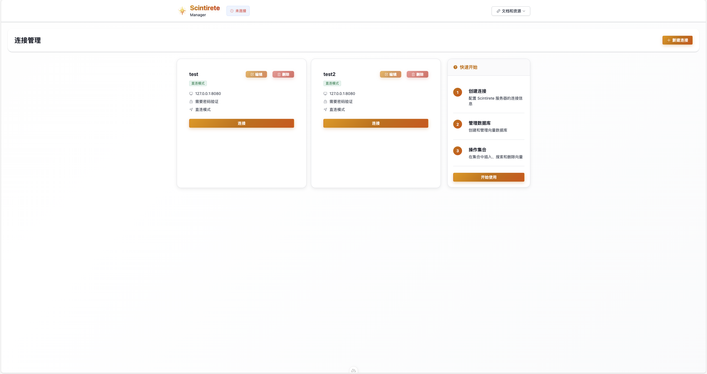
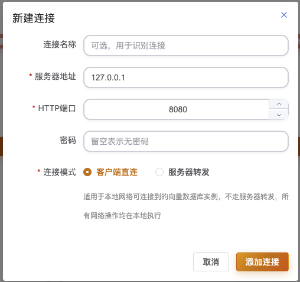
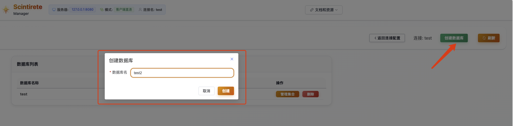
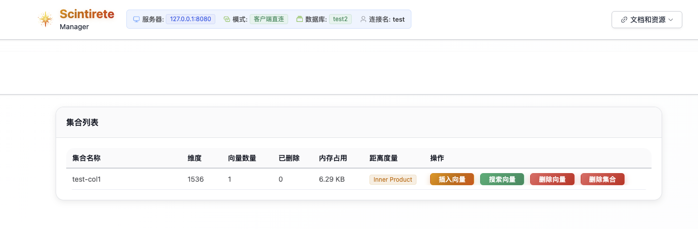
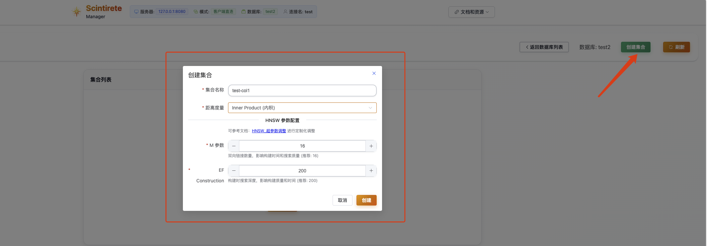
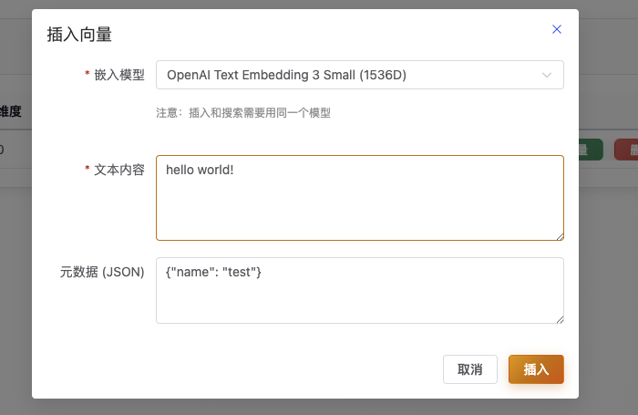
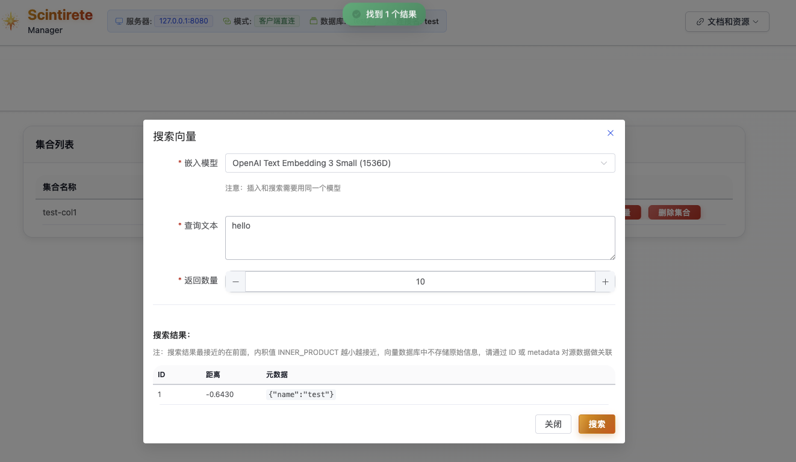
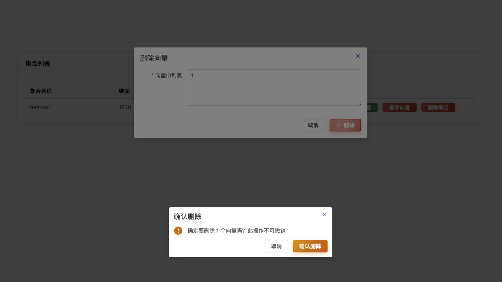

# ManagerUI User Guide

ManagerUI is the Web management interface for Scintirete, providing an intuitive visual operation experience. You can easily manage databases, collections, and vector data through a browser without command-line operations.

## 🌐 Access Entry

### Online Demo Version

**Demo Access URL**: [http://scintirete-manager-ui.cloud.wj2015.com/](http://scintirete-manager-ui.cloud.wj2015.com/)

> ⚠️ **Security Restrictions**: The online demo version only supports client direct connection mode for security reasons, and does not support server forwarding mode. The local deployment version supports all features.

> ⚠️ **Access Address**: The official access address is undergoing domain ICP registration, please wait patiently.

### Local Deployment

If you need full functionality, we recommend deploying ManagerUI locally:

```bash
# Deploy using Docker (recommended)
docker run -d \
  --name scintirete-manager-ui \
  -p 3000:3000 \
  scintirete/manager-ui:latest

# Access URL
# http://localhost:3000
```

## 🚀 Quick Start

### 1. Open Management Interface

Visit the ManagerUI URL in your browser, and you will see the connection configuration page:



### 2. Configure Server Connection

First-time use requires configuring connection to Scintirete server:

  

**Connection Parameter Description**:

| Parameter | Description | Example Value |
|-----------|-------------|---------------|
| **Server Address** | IP or domain name of Scintirete server | `localhost` or `192.168.1.100` |
| **HTTP Port** | HTTP API port | `8080` |
| **gRPC Port** | gRPC service port | `9090` |
| **Access Password** | Server authentication password | Your password |
| **Connection Mode** | Client Direct Connection / Server Forwarding | Choose appropriate mode |

### 3. Connection Mode Selection

ManagerUI supports two connection modes:

#### 🔗 Client Direct Connection Mode (Recommended)
- **Feature**: Browser directly connects to Scintirete server
- **Advantages**: Best performance, lowest latency
- **Use Cases**: LAN environment, development testing
- **Requirements**: Browser can directly access Scintirete server

#### 🌐 Server Forwarding Mode
- **Feature**: Forwards requests through ManagerUI server proxy
- **Advantages**: Supports cross-network access, better security
- **Use Cases**: Production environment, cross-network access
- **Requirements**: ManagerUI server can access Scintirete server

## 🔗 Connection Management Features

### Connection Configuration Saving

ManagerUI securely saves connection configurations to the browser's `localStorage`:

**Feature Characteristics**:
- ✅ **Local Storage**: Configuration information saved locally, no need to re-enter
- ✅ **Multi-configuration Management**: Support saving multiple server connection configurations
- ✅ **Quick Switching**: One-click switching between different server environments

### Connection Health Check

Before connecting, ManagerUI automatically tests connection availability:

**Check Items**:
- 🔍 **Network Connectivity**: Check if server is reachable
- 🔐 **Authentication Verification**: Verify if password is correct  
- 📊 **Service Status**: Confirm service is running normally
- ⚡ **Response Latency**: Measure network latency

## 🗄️ Database Management

### Database List

After successful connection, enter the database management interface:

**Interface Features**:
- 📋 **Database List**: Display all available databases
- ➕ **Create Database**: Quickly create new database
- 📊 **Statistics**: Show collection count for each database
- 🔍 **Search Filter**: Quickly find specific databases

### Create Database

Click the "Create Database" button:



**Creation Steps**:
1. Enter database name (supports Chinese and English)
2. Optionally add description information
3. Click confirm to create


## 📊 Collection Operations

### Collection Information Overview

Click on database to enter collection management interface:



**Information Display**:
- 📏 **Vector Dimension**: Display vector dimension in collection
- 🔢 **Vector Count**: Current total number of stored vectors
- 💾 **Memory Usage**: Real-time memory usage
- 📐 **Distance Metric**: Similarity calculation method used
- 🗑️ **Deletion Statistics**: Number of vectors marked for deletion

### Create Collection

Create new collection within database:



**Configuration Options**:
- **Collection Name**: English letters, numbers, underscores
- **Distance Metric**: 
  - `Cosine` - Cosine similarity (recommended for text)
  - `L2` - Euclidean distance (recommended for images)
  - `Inner Product` - Inner product
- **HNSW Parameters**:
  - `maxConnections` - Maximum connections (default: 32)
  - `efConstruction` - Construction parameter (default: 200)

### Vector Insert Operations

ManagerUI supports flexible vector data insertion:



### Vector Search Function

Text semantic search functionality:



### Vector Deletion



## 🔧 Troubleshooting

### Common Connection Issues

**Cannot connect to server**:
1. Check if server address and port are correct
2. Confirm firewall settings allow access
3. Verify Scintirete service is running normally
4. Check network connectivity

**Authentication failed**:
1. Confirm password is entered correctly
2. Check server-side password configuration
3. Check server logs for error details

**Feature abnormalities**:
1. Refresh browser page
2. Clear browser cache
3. Check browser console for error messages
4. Switch to private/incognito mode for testing

### Performance Optimization Recommendations

**Slow page loading**:
- Reduce amount of data displayed simultaneously
- Use pagination for large datasets
- Enable browser caching
- Check network latency

**Slow search response**:
- Optimize search parameter settings
- Reduce number of returned results
- Check server resource usage
- Consider hardware upgrades

Through ManagerUI, you can intuitively and efficiently manage Scintirete vector databases without complex command-line operations, enjoying a modern Web management experience.