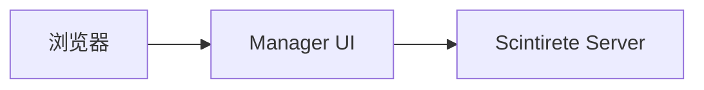
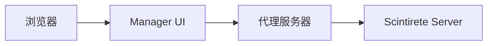

# 管理 UI 使用指南

Scintirete Manager UI 是一个基于 Nuxt.js 4.0 开发的高性能向量数据库管理工具，提供了直观的 Web 界面来管理您的 Scintirete 实例。

## 概述

### 访问地址

- **生产环境**: [manager.scintirete.wj2015.com](https://manager.scintirete.wj2015.com)
- **本地开发**: `http://localhost:3000`

### 核心功能

- 🔗 **连接管理**: 支持客户端直连和服务器转发模式
- 🗄️ **数据库管理**: 创建、删除、查看数据库信息
- 📊 **集合操作**: 向量插入、搜索、删除，支持文本嵌入
- 🎨 **用户体验**: 响应式设计、暗色主题、中文界面

## 快速开始

### 环境要求

- **Node.js**: >= 16.x
- **pnpm**: >= 8.x
- **浏览器**: 现代浏览器，支持 ES6+

### 本地开发

```bash
# 克隆仓库
git clone https://github.com/scintirete/manager-ui.git
cd manager-ui

# 安装依赖
pnpm install

# 启动开发服务器
pnpm dev

# 访问应用
打开浏览器访问 http://localhost:3000
```

### 生产部署

```bash
# 构建应用
pnpm build

# 预览构建结果
pnpm preview
```

## 连接管理

### 连接配置界面

访问管理 UI 后，首先需要配置 Scintirete 服务器连接：


### 连接参数

| 参数 | 说明 | 必需 |
|------|------|------|
| 服务器地址 | Scintirete 服务器地址 | 是 |
| HTTP 端口 | HTTP API 端口（默认 8080） | 是 |
| gRPC 端口 | gRPC API 端口（默认 9090） | 是 |
| 密码 | 访问密码 | 是 |
| 连接模式 | 客户端直连 / 服务器转发 | 是 |

### 连接模式

#### 客户端直连模式

- **特点**: 直接连接到 Scintirete 服务器
- **优势**: 性能更优，延迟更低
- **适用**: 本地网络环境，无跨域限制



#### 服务器转发模式

- **特点**: 通过 Manager UI 的代理服务器转发请求
- **优势**: 支持跨域和网络隔离场景
- **适用**: 内网环境，有防火墙限制



### 连接测试

配置完成后，点击"测试连接"按钮：

```javascript
// 连接测试逻辑
async function testConnection(config) {
  try {
    const response = await fetch('/api/health', {
      headers: {
        'Authorization': `Bearer ${config.password}`
      }
    });
    
    if (response.ok) {
      return { success: true, message: '连接成功' };
    } else {
      return { success: false, message: '认证失败' };
    }
  } catch (error) {
    return { success: false, message: '网络连接失败' };
  }
}
```

### 连接管理

- **保存连接**: 配置会保存到浏览器 localStorage
- **多连接管理**: 支持保存多个服务器连接配置
- **快速切换**: 在不同服务器间快速切换

## 数据库管理

### 数据库列表


### 数据库操作

#### 创建数据库

```javascript
// 创建数据库 API 调用
async function createDatabase(name, options = {}) {
  const response = await fetch('/api/v1/databases', {
    method: 'POST',
    headers: {
      'Content-Type': 'application/json',
      'Authorization': `Bearer ${password}`
    },
    body: JSON.stringify({
      name,
      options: {
        enable_persistence: true,
        max_memory: '4GB',
        ...options
      }
    })
  });
  
  return await response.json();
}
```

#### 数据库信息查看

点击数据库名称查看详细信息：

```javascript
// 获取数据库信息
async function getDatabaseInfo(databaseName) {
  const response = await fetch(`/api/v1/databases/${databaseName}`, {
    headers: {
      'Authorization': `Bearer ${password}`
    }
  });
  
  return await response.json();
}
```

#### 删除数据库

```javascript
// 删除数据库
async function deleteDatabase(databaseName) {
  const response = await fetch(`/api/v1/databases/${databaseName}`, {
    method: 'DELETE',
    headers: {
      'Authorization': `Bearer ${password}`
    }
  });
  
  return await response.json();
}
```

### 数据库统计

每个数据库卡片显示关键统计信息：

- **集合数量**: 当前数据库中的集合总数
- **向量总数**: 所有集合的向量总数
- **内存使用**: 当前内存占用
- **创建时间**: 数据库创建时间

## 集合管理

### 集合列表


### 集合操作

#### 创建集合

```javascript
// 创建集合
async function createCollection(databaseName, collectionName, config) {
  const response = await fetch(`/api/v1/databases/${databaseName}/collections`, {
    method: 'POST',
    headers: {
      'Content-Type': 'application/json',
      'Authorization': `Bearer ${password}`
    },
    body: JSON.stringify({
      name: collectionName,
      dimension: config.dimension,
      metric: config.metric,
      options: {
        max_connections: config.maxConnections,
        ef_construction: config.efConstruction,
        ef_search: config.efSearch
      }
    })
  });
  
  return await response.json();
}
```

#### 集合配置参数

| 参数 | 说明 | 默认值 | 建议值 |
|------|------|--------|--------|
| dimension | 向量维度 | - | 根据嵌入模型确定 |
| metric | 距离度量 | Cosine | Cosine/Euclidean |
| max_connections | HNSW 最大连接数 | 16 | 16-64 |
| ef_construction | 构建时候选数 | 40 | 40-200 |
| ef_search | 搜索时候选数 | 50 | 50-100 |

### 向量操作

#### 向量插入

支持多种插入方式：

##### 1. 直接插入向量

```javascript
// 插入预计算向量
async function insertVectors(databaseName, collectionName, vectors) {
  const response = await fetch(`/api/v1/databases/${databaseName}/collections/${collectionName}/vectors`, {
    method: 'POST',
    headers: {
      'Content-Type': 'application/json',
      'Authorization': `Bearer ${password}`
    },
    body: JSON.stringify({
      vectors: vectors
    })
  });
  
  return await response.json();
}
```

##### 2. 文本插入（自动嵌入）

```javascript
// 插入文本并自动嵌入
async function insertTexts(databaseName, collectionName, texts) {
  const response = await fetch(`/api/v1/databases/${databaseName}/collections/${collectionName}/text`, {
    method: 'POST',
    headers: {
      'Content-Type': 'application/json',
      'Authorization': `Bearer ${password}`
    },
    body: JSON.stringify({
      texts: texts
    })
  });
  
  return await response.json();
}
```

#### 向量搜索

##### 1. 向量搜索

```javascript
// 向量搜索
async function searchVectors(databaseName, collectionName, queryVector, options = {}) {
  const response = await fetch(`/api/v1/databases/${databaseName}/collections/${collectionName}/search`, {
    method: 'POST',
    headers: {
      'Content-Type': 'application/json',
      'Authorization': `Bearer ${password}`
    },
    body: JSON.stringify({
      vector: queryVector,
      top_k: options.topK || 10,
      include_metadata: options.includeMetadata !== false,
      filter: options.filter || {}
    })
  });
  
  return await response.json();
}
```

##### 2. 文本搜索（语义搜索）

```javascript
// 文本搜索
async function searchTexts(databaseName, collectionName, query, options = {}) {
  const response = await fetch(`/api/v1/databases/${databaseName}/collections/${collectionName}/text/search`, {
    method: 'POST',
    headers: {
      'Content-Type': 'application/json',
      'Authorization': `Bearer ${password}`
    },
    body: JSON.stringify({
      query: query,
      top_k: options.topK || 10,
      filter: options.filter || {}
    })
  });
  
  return await response.json();
}
```

#### 搜索结果展示

搜索结果以表格形式展示，包含：

- **ID**: 向量唯一标识
- **得分**: 相似度得分（0-1）
- **距离**: 距离值
- **元数据**: 向量关联的元数据
- **预览**: 文本内容预览（如果是文本向量）

### 批量操作

#### 批量插入

```javascript
// 批量插入向量
async function batchInsertVectors(databaseName, collectionName, vectors) {
  const response = await fetch(`/api/v1/databases/${databaseName}/collections/${collectionName}/vectors/batch`, {
    method: 'POST',
    headers: {
      'Content-Type': 'application/json',
      'Authorization': `Bearer ${password}`
    },
    body: JSON.stringify({
      vectors: vectors
    })
  });
  
  return await response.json();
}
```

#### 批量删除

```javascript
// 批量删除向量
async function batchDeleteVectors(databaseName, collectionName, vectorIds) {
  const response = await fetch(`/api/v1/databases/${databaseName}/collections/${collectionName}/vectors`, {
    method: 'DELETE',
    headers: {
      'Content-Type': 'application/json',
      'Authorization': `Bearer ${password}`
    },
    body: JSON.stringify({
      ids: vectorIds
    })
  });
  
  return await response.json();
}
```

## 用户界面特性

### 响应式设计

管理 UI 采用响应式设计，适配各种设备：

- **桌面端**: 完整功能，多列布局
- **平板端**: 适配布局，触摸优化
- **手机端**: 简化界面，核心功能

### 暗色主题

支持明暗主题切换：

```javascript
// 主题切换逻辑
function toggleTheme() {
  if (document.documentElement.classList.contains('dark')) {
    document.documentElement.classList.remove('dark');
    localStorage.setItem('theme', 'light');
  } else {
    document.documentElement.classList.add('dark');
    localStorage.setItem('theme', 'dark');
  }
}
```

### 数据可视化

提供多种数据可视化图表：

#### 1. 集合统计图表

```javascript
// 集合统计图表配置
const collectionStatsChart = {
  type: 'bar',
  data: {
    labels: ['Documents', 'Images', 'Audio'],
    datasets: [{
      label: '向量数量',
      data: [1250, 3500, 800],
      backgroundColor: [
        'rgba(255, 99, 132, 0.5)',
        'rgba(54, 162, 235, 0.5)',
        'rgba(255, 205, 86, 0.5)'
      ]
    }]
  }
};
```

#### 2. 性能监控图表

```javascript
// 性能监控图表配置
const performanceChart = {
  type: 'line',
  data: {
    labels: ['00:00', '04:00', '08:00', '12:00', '16:00', '20:00'],
    datasets: [{
      label: 'QPS',
      data: [10, 15, 25, 30, 20, 12],
      borderColor: 'rgb(75, 192, 192)',
      tension: 0.1
    }]
  }
};
```

### 实时更新

支持实时数据更新：

```javascript
// WebSocket 连接
const ws = new WebSocket('ws://localhost:3000/api/updates');

ws.onmessage = (event) => {
  const data = JSON.parse(event.data);
  updateUI(data);
};
```

## 错误处理

### 常见错误及解决方案

| 错误类型 | 原因 | 解决方案 |
|----------|------|----------|
| 连接失败 | 网络问题或服务器未启动 | 检查网络连接和服务器状态 |
| 认证失败 | 密码错误 | 验证密码是否正确 |
| 权限不足 | 操作权限不够 | 检查用户权限设置 |
| 数据格式错误 | 输入数据格式不正确 | 检查数据格式和类型 |
| 服务器错误 | 服务器内部错误 | 查看服务器日志 |

### 错误提示

```javascript
// 错误提示组件
function ErrorMessage({ error }) {
  return (
    <div className="error-message">
      <div className="error-icon">⚠️</div>
      <div className="error-content">
        <div className="error-title">{error.code}</div>
        <div className="error-description">{error.message}</div>
      </div>
    </div>
  );
}
```

## 性能优化

### 前端优化

- **代码分割**: 按路由分割代码，减少初始加载时间
- **懒加载**: 图片和组件懒加载，提升页面性能
- **缓存策略**: 合理使用浏览器缓存，减少重复请求

### 后端优化

- **连接池**: 复用数据库连接，减少连接开销
- **批量操作**: 支持批量插入和删除，提高吞吐量
- **缓存机制**: 缓存频繁访问的数据

## 最佳实践

### 1. 连接配置

- 使用有意义的连接名称
- 定期测试连接状态
- 保存常用连接配置

### 2. 数据库管理

- 合理规划数据库结构
- 定期清理无用数据
- 监控数据库性能

### 3. 集合设计

- 选择合适的距离度量
- 优化索引参数
- 合理设置向量维度

### 4. 向量操作

- 使用批量操作提高效率
- 合理设置搜索参数
- 注意元数据大小

---

通过本章的指南，您应该能够熟练使用 Scintirete Manager UI 进行数据库管理。如有任何问题，请参考 [故障排除](./troubleshooting.md) 章节。