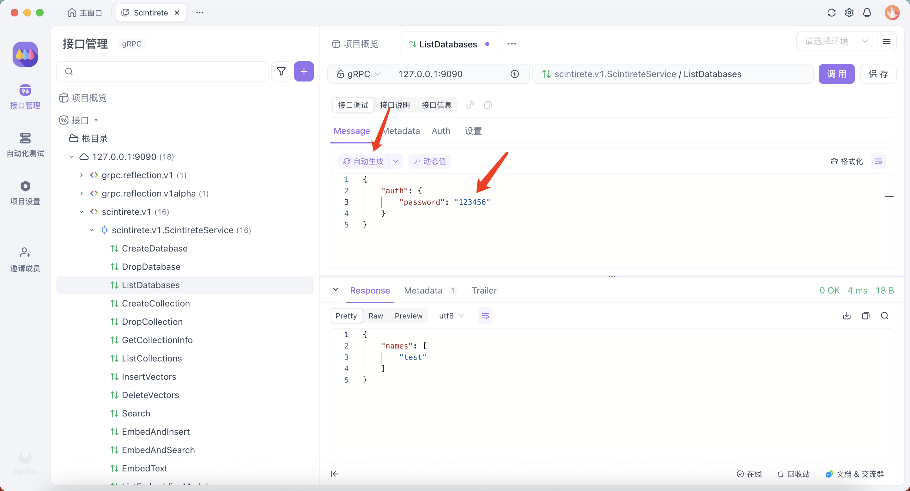

# gRPC 接口调用指南

Scintirete 提供了完整的 gRPC 接口，支持所有向量数据库操作。gRPC 接口具有更高的性能和更强的类型安全性，适合对性能要求较高的生产环境。

## 🚀 快速开始

### 服务发现和反射

Scintirete gRPC 服务**启用了服务器反射**，这意味着你可以直接在支持 gRPC 反射的工具中使用，无需手动导入 proto 文件。

**支持的工具**：
- [Apifox](https://www.apifox.cn/) - 推荐，界面友好
- [Postman](https://www.postman.com/) - 支持 gRPC 调用
- [BloomRPC](https://github.com/bloomrpc/bloomrpc) - 专用 gRPC 客户端
- [grpcurl](https://github.com/fullstorydev/grpcurl) - 命令行工具

### 连接配置

**默认连接参数**：
- **地址**: `localhost:9090`
- **协议**: `gRPC` (HTTP/2)
- **TLS**: 开发环境默认关闭，生产环境建议开启
- **认证**: 需要 Bearer Token（除了健康检查）

## 🛠️ 使用 Apifox 调用（推荐）

### 1. 创建 gRPC 项目

1. 打开 Apifox，创建新项目
2. 选择 **"导入"** → **"gRPC"**
3. 选择 **"服务器反射"** 方式
4. 输入服务器地址：`localhost:9090`


### 2. 配置 proto


### 3. 服务接口概览

导入成功后，你将看到以下服务接口：


### 4. 调用接口



## 📊 性能对比

gRPC 相比 HTTP API 的优势：

| 特性 | gRPC | HTTP API |
|------|------|----------|
| **性能** | 更快（二进制协议） | 较慢（JSON 解析） |
| **类型安全** | 强类型（protobuf） | 弱类型（JSON） |
| **流式处理** | 支持 | 不支持 |
| **代码生成** | 自动生成客户端 | 手动编写 |
| **调试难度** | 中等 | 简单 |
| **浏览器兼容** | 需要 gRPC-Web | 原生支持 |

## 🛡️ 最佳实践

### 准备工作

```bash
git clone https://github.com/scintirete/scintirete.git
cd scintirete
make proto-gen
```

在 `gen/go/scintirete/v1` 目录下，你会看到自动生成的 protobuf 代码。

### 1. 连接管理

```go
// 使用连接池
var (
    conn   *grpc.ClientConn
    client pb.ScintireteServiceClient
)

func init() {
    var err error
    conn, err = grpc.Dial("localhost:9090",
        grpc.WithInsecure(),
        grpc.WithKeepaliveParams(keepalive.ClientParameters{
            Time:                10 * time.Second,
            Timeout:             3 * time.Second,
            PermitWithoutStream: true,
        }),
    )
    if err != nil {
        panic(err)
    }
    client = pb.NewScintireteServiceClient(conn)
}
```

### 2. 错误处理

```go
import (
    "google.golang.org/grpc/codes"
    "google.golang.org/grpc/status"
)

func handleGRPCError(err error) {
    if st, ok := status.FromError(err); ok {
        switch st.Code() {
        case codes.NotFound:
            fmt.Println("资源不存在")
        case codes.PermissionDenied:
            fmt.Println("权限不足") 
        case codes.InvalidArgument:
            fmt.Println("参数无效")
        default:
            fmt.Printf("gRPC 错误: %v\n", st.Message())
        }
    }
}
```

### 3. 批量操作优化

```go
// 批量插入向量（推荐）
vectors := make([]*pb.Vector, 1000)
for i := 0; i < 1000; i++ {
    vectors[i] = &pb.Vector{
        Data: generateRandomVector(768),
        Metadata: map[string]string{
            "id": fmt.Sprintf("doc_%d", i),
        },
    }
}

_, err := client.InsertVectors(ctx, &pb.InsertVectorsRequest{
    DatabaseName:   "my_db",
    CollectionName: "docs",
    Vectors:        vectors,
})
```

## 🔧 故障排除

### 常见错误

**连接失败**：
```
rpc error: code = Unavailable desc = connection error
```
- 检查服务器是否运行在正确端口
- 确认防火墙设置
- 验证网络连通性

**认证失败**：
```
rpc error: code = PermissionDenied desc = invalid token
```
- 检查 Bearer Token 是否正确
- 验证 authorization header 格式

**参数错误**：
```
rpc error: code = InvalidArgument desc = dimension mismatch
```
- 检查向量维度是否一致
- 验证必填字段是否完整
- 确认数据类型是否正确

通过 gRPC 接口，你可以构建高性能的向量搜索应用，享受强类型和高效二进制协议带来的优势。