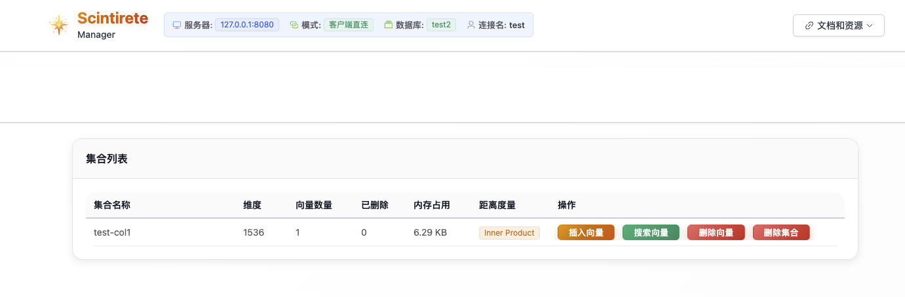
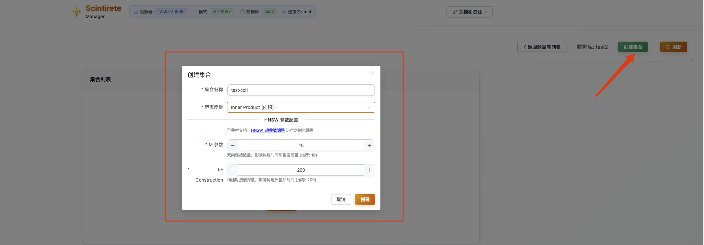
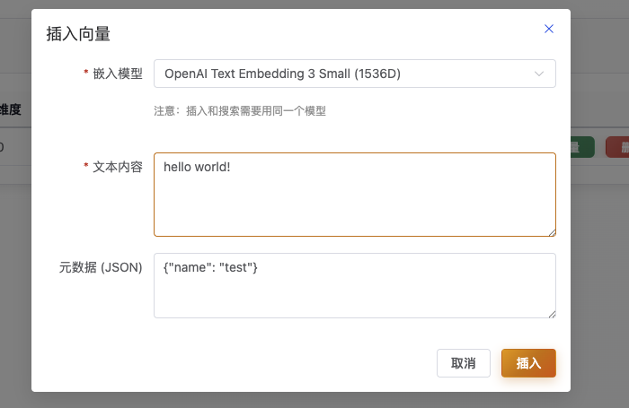
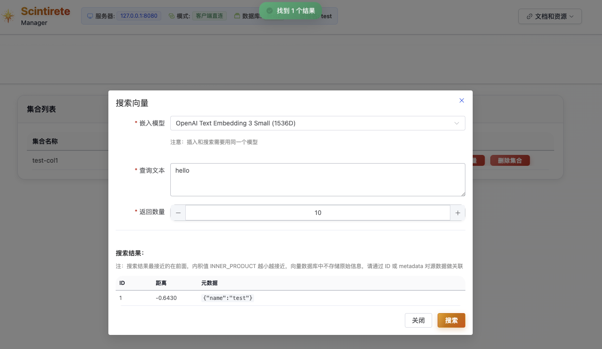

# ManagerUI 使用指南

ManagerUI 是 Scintirete 的 Web 管理界面，提供直观的可视化操作体验。通过浏览器即可轻松管理数据库、集合和向量数据，无需命令行操作。

## 🌐 访问入口

### 在线体验版

**临时云端访问地址**: [http://scintirete-manager-ui.cloud.wj2015.com/](http://scintirete-manager-ui.cloud.wj2015.com/)

> ⚠️ **安全限制**: 在线体验版出于安全考虑，仅支持客户端直连模式，不支持服务器转发模式。本地部署版本支持全部功能。
> ⚠️ **访问地址**: 正式访问地址正在进行域名备案，请耐心等待。

### 本地部署

如果你需要完整功能，建议本地部署 ManagerUI：

```bash
# 使用 Docker 部署（推荐）
docker run -d \
  --name scintirete-manager-ui \
  -p 3000:3000 \
  scintirete/manager-ui:latest

# 访问地址
# http://localhost:3000
```

## 🚀 快速开始

### 1. 打开管理界面

在浏览器中访问 ManagerUI 地址，你将看到连接配置页面：


### 2. 配置服务器连接

首次使用需要配置连接到 Scintirete 服务器：

  

**连接参数说明**：

| 参数 | 说明 | 示例值 |
|------|------|--------|
| **服务器地址** | Scintirete 服务器的 IP 或域名 | `localhost` 或 `192.168.1.100` |
| **HTTP 端口** | HTTP API 端口 | `8080` |
| **gRPC 端口** | gRPC 服务端口 | `9090` |
| **访问密码** | 服务器认证密码 | 你的密码 |
| **连接模式** | 客户端直连 / 服务器转发 | 选择合适的模式 |

### 3. 连接模式选择

ManagerUI 支持两种连接模式：

#### 🔗 客户端直连模式（推荐）
- **特点**: 浏览器直接连接到 Scintirete 服务器
- **优势**: 性能最佳，延迟最低
- **适用场景**: 局域网环境，开发测试
- **要求**: 浏览器能直接访问 Scintirete 服务器

#### 🌐 服务器转发模式
- **特点**: 通过 ManagerUI 服务器代理转发请求
- **优势**: 支持跨网络访问，更好的安全性
- **适用场景**: 生产环境，跨网络访问
- **要求**: ManagerUI 服务器能访问 Scintirete 服务器

## 🔗 连接管理功能

### 连接配置保存

ManagerUI 会将连接配置安全保存到浏览器的 `localStorage` 中：

**功能特性**：
- ✅ **本地存储**: 配置信息保存在本地，无需重复输入
- ✅ **多配置管理**: 支持保存多个服务器连接配置
- ✅ **快速切换**: 一键切换不同的服务器环境

### 连接健康检查

在连接之前，ManagerUI 会自动测试连接可用性：

**检查项目**：
- 🔍 **网络连通性**: 检查服务器是否可达
- 🔐 **认证验证**: 验证密码是否正确  
- 📊 **服务状态**: 确认服务正常运行
- ⚡ **响应延迟**: 测量网络延迟

## 🗄️ 数据库管理

### 数据库列表

连接成功后，进入数据库管理界面：

**界面功能**：
- 📋 **数据库列表**: 显示所有可用数据库
- ➕ **创建数据库**: 快速创建新数据库
- 📊 **统计信息**: 显示每个数据库的集合数量
- 🔍 **搜索过滤**: 快速查找特定数据库

### 创建数据库

点击"创建数据库"按钮：


**创建步骤**：
1. 输入数据库名称（支持中英文）
2. 可选择添加描述信息
3. 点击确认创建


## 📊 集合操作

### 集合信息概览

点击数据库进入集合管理界面：



**信息展示**：
- 📏 **向量维度**: 显示集合中向量的维度
- 🔢 **向量数量**: 当前存储的向量总数
- 💾 **内存占用**: 实时内存使用情况
- 📐 **距离度量**: 使用的相似度计算方法
- 🗑️ **删除统计**: 标记删除的向量数量

### 创建集合

在数据库内创建新集合：



**配置选项**：
- **集合名称**: 英文字母、数字、下划线
- **距离度量**: 
  - `Cosine` - 余弦相似度（推荐用于文本）
  - `L2` - 欧氏距离（推荐用于图像）
  - `Inner Product` - 内积
- **HNSW 参数**:
  - `maxConnections` - 最大连接数（默认：32）
  - `efConstruction` - 构建参数（默认：200）

### 向量插入操作

ManagerUI 支持灵活的向量数据插入：



### 向量搜索功能

文本语义搜索功能：



### 向量删除


## 🔧 故障排除

### 常见连接问题

**无法连接到服务器**：
1. 检查服务器地址和端口是否正确
2. 确认防火墙设置允许访问
3. 验证 Scintirete 服务是否正常运行
4. 检查网络连通性

**认证失败**：
1. 确认密码输入正确
2. 检查服务器端密码配置
3. 查看服务器日志确认错误原因

**功能异常**：
1. 刷新浏览器页面
2. 清理浏览器缓存
3. 检查浏览器控制台错误信息
4. 切换到隐私模式测试

### 性能优化建议

**页面加载慢**：
- 减少同时显示的数据量
- 使用分页加载大数据集
- 启用浏览器缓存
- 检查网络延迟

**搜索响应慢**：
- 优化搜索参数设置
- 减少返回结果数量
- 检查服务器资源使用
- 考虑升级硬件配置

通过 ManagerUI，你可以直观、高效地管理 Scintirete 向量数据库，无需复杂的命令行操作，享受现代化的 Web 管理体验。